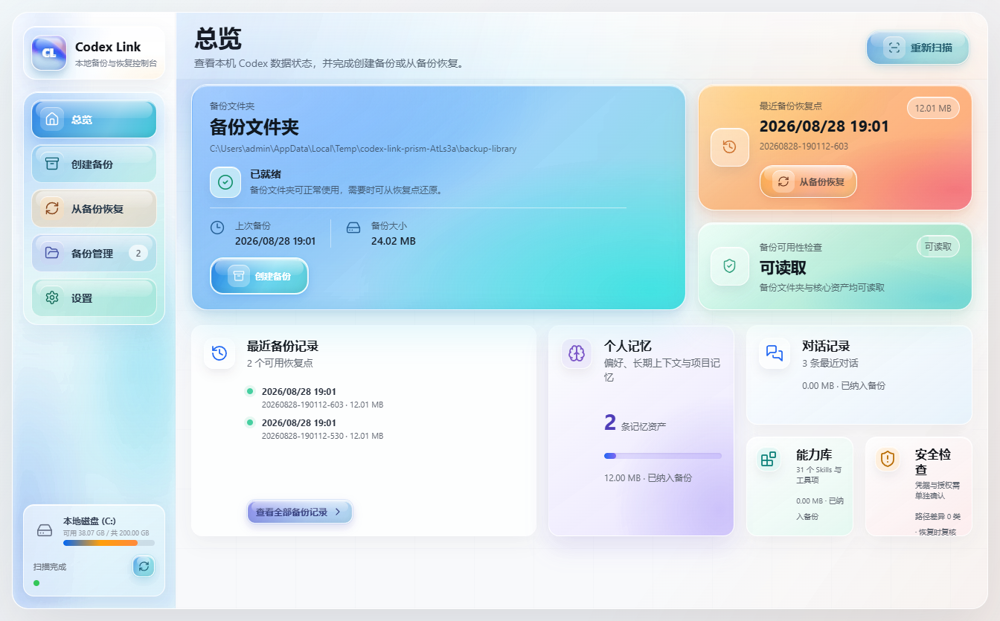

# Codex Link

Codex Link is an open-source tool built for a specific Codex pain point: local Codex environments are valuable, but they are hard to move safely. Conversations, project indexes, rules, memories, settings, and Skills live across local files and databases; direct folder copying can carry broken paths, SQLite state risks, and credential concerns. Codex Link provides a previewable, verifiable, rollback-protected backup and restore flow for Windows and macOS workflows.

Codex Link is an independent open-source project and is not affiliated with or endorsed by OpenAI.



Languages: [English](README.md) | [简体中文](README.zh-CN.md)

Project links: [Chinese quick start](docs/QUICK_START.zh-CN.md) | [Changelog](CHANGELOG.md) | [Contributing](CONTRIBUTING.md) | [Security](SECURITY.md) | [License](LICENSE)

Downloads for v1.0.0:

- Windows: download `Codex-Link-Setup-1.0.0-x64.exe` from the GitHub Release.
- macOS Apple Silicon: download `Codex-Link-1.0.0-mac-arm64-source.zip` from the GitHub Release and build it on an Apple Silicon Mac. This release does not include a signed or notarized macOS installer.
- Checksums: verify release files with `SHA256SUMS.txt`.

Current capabilities:

- Scan a local Codex home directory.
- Show conversations, storage sections, installed skills, plugin skills, MCP servers, and migration risks.
- Preview a backup plan before copying files.
- Create one unified restore point containing both broad categories and individually selected conversations or skills.
- Build recommended, safe-all, full, or custom restore plans from the items actually present in a restore point.
- Create a timestamped restore point with a persisted per-file SHA-256 manifest.
- Validate restore-point contents before any target files are changed.
- Execute restores through a same-disk staging area with an automatic rollback point.
- Verify every restored file and automatically restore the original target when execution or verification fails.
- Persist a restore transaction journal and recover interrupted writes on the next service start or restore attempt.
- List existing restore points and generate Mac/Windows compatibility notes for paths and local tools.
- Choose and open backup folders with native desktop dialogs while retaining the browser preset fallback for development.
- Enforce the configured restore-point retention limit after a new verified restore point is complete.
- Persist restore safety policy: rollback protection is mandatory, cross-system adaptation is optional, and high-risk content is excluded by default.

Run the desktop app in development:

```bash
npm start
```

Run the browser-based development server when needed:

```bash
npm run start:web
```

Build the Windows x64 installer:

```bash
npm run build:win
```

The installer is written to `dist/Codex-Link-Setup-<version>-x64.exe`. Desktop settings are stored in Electron's per-user application data directory, outside the read-only installed application.

Build and verify the unsigned Apple Silicon package on an M1/M2/M3/M4 Mac:

```bash
npm run package:mac:arm64
```

This one-command gate installs the locked dependencies, runs syntax checks and all tests, builds native `arm64` DMG and ZIP packages, verifies the Mach-O architecture and `Info.plist`, mounts the DMG, extracts the ZIP, and smoke-launches the unpacked app. It writes:

- `dist/Codex-Link-<version>-mac-arm64.dmg`
- `dist/Codex-Link-<version>-mac-arm64.zip`
- `dist/mac-arm64/Codex Link.app`
- `qa/reports/macos-arm64-release-latest.json`
- `qa/reports/macos-arm64-release-latest.md`

The runtime check launches the app extracted from the final ZIP, confirms it remains alive for at least 8 seconds, and records the DMG/ZIP hashes plus all release checks in the reports. If packages already exist, rerun only the final gate with `npm run verify:mac:release`.

The default command deliberately disables signing certificate auto-discovery and produces an unsigned smoke artifact. It is suitable for local or CI validation, but it is not a notarized public release.

For a signed and notarized release, install Xcode command-line tools and provide a Developer ID Application certificate plus either App Store Connect API credentials or Apple ID notarization credentials:

```bash
export CODEX_LINK_MAC_RELEASE=1
export CSC_LINK=/secure/path/DeveloperIDApplication.p12
export CSC_KEY_PASSWORD='certificate-password'

# Preferred for CI:
export APPLE_API_KEY=/secure/path/AuthKey_XXXXXXXXXX.p8
export APPLE_API_KEY_ID=XXXXXXXXXX
export APPLE_API_ISSUER=00000000-0000-0000-0000-000000000000

# Alternative: APPLE_ID, APPLE_APP_SPECIFIC_PASSWORD, APPLE_TEAM_ID
npm run package:mac:arm64
```

Release mode additionally runs `codesign --verify`, `spctl --assess`, and `xcrun stapler validate`. Do not report a package as signed or notarized unless those checks pass. A CI runner must report `uname -m` as `arm64`; a `macos-15` Apple Silicon runner or a self-hosted Apple Silicon Mac is appropriate.

The macOS desktop configuration is stored at `~/Library/Application Support/Codex Link/codex-link.config.local.json`; Windows continues to use its Electron per-user application-data directory. Settings writes are durable and retain a `.bak` last-known-good copy. Foreign drive paths fall back to local defaults instead of being resolved inside the application bundle.

Restore-point manifests use portable forward-slash paths and record both source OS and architecture. Legacy Windows selection manifests containing backslashes remain readable on macOS. During a cross-system restore, `config.toml` is placed under `.codex/_codex-link-import/` for manual merging so platform-specific commands and paths cannot overwrite the target configuration.

Product acceptance self-check:

```bash
# Strict release gate. Exits non-zero when a P0 requirement, Mac runtime
# evidence, or independent manual review is missing.
npm run self-check

# Development-stage gate. Keeps release gaps visible but does not treat
# unfinished restore execution as a stage blocker.
npm run self-check:stage
```

The generated Markdown and JSON reports are written to `qa/reports/`. See
`qa/SELF_CHECK.md` for the 100-point rubric and manual review workflow.

Initialize and validate an independent manual review:

```bash
npm run manual:init -- --reviewer QA-01
# Fill qa/manual-review.json with actual participants, evidence and scores.
npm run manual:validate
node scripts/codex-link-self-check.js --profile release --manual qa/manual-review.json
```

The release review requires a named independent reviewer, at least five first-time users, at least three target users, one or more evidence artifacts, and actual observations rather than unchanged template instructions.

Portable project restore (format version 4):

- Every new restore point contains a hashed `payload/projects.json` catalog with stable project IDs plus per-thread IDs, titles, active/archive buckets, relative rollout paths, timestamps, sizes, source platform, and an explicit `projectFilesIncluded` flag.
- The restore selector renders a project tree with tri-state project checkboxes and individual conversation checkboxes. Selecting a project selects only its child conversations.
- The default backup stores conversation-to-project ownership only. It does not copy project source code, media, or other project-directory files.
- Format v1-v3 restore points remain readable. When the v4 thread catalog is absent, the planner rebuilds candidates from `state_5.sqlite` and JSONL `session_meta` / `turn_context` records and marks the plan as a legacy migration.
- Cross-system selective restore requires mappings only for selected projects. A full `state_5.sqlite` replacement still requires every indexed project to be mapped. Duplicate targets are rejected.
- Path adaptation changes only selected SQLite index rows and JSONL path-metadata records; user/assistant messages and code blocks are never globally replaced.

SQLite restore safety:

1. The backup uses SQLite `VACUUM INTO` to create a consistent database image that includes committed WAL state.
2. Restore verifies the source manifest before staging and blocks a real user-home database restore while Codex/ChatGPT is running.
3. Existing target `state_5.sqlite-wal` or `state_5.sqlite-shm` files block installation instead of being mixed with the restored database.
4. For selective restore, the engine clones the existing target database in the isolated staging directory and upserts only selected `threads.id` rows from the verified backup database. Unselected target rows remain untouched.
5. The staged database must match its pre-adaptation geometry and page count, then pass both `quick_check` and `integrity_check`.
6. Project and rollout paths are updated transactionally for selected threads. Selected thread counts and non-empty `rollout_path` values are checked against staged session files.
7. Only then is a verified rollback point created and the database installed through a same-disk temporary file and rename sequence.
8. The transaction journal records `files_copied`, `paths_adapted`, `sqlite_validated`, `session_paths_validated`, `installed`, and finally `completed`. Failures retain diagnostics and never write `completed`.

Safety notes:

- The overview and audit features are read-only.
- Backup creation copies selected files into the chosen local backup folder and records SHA-256 for every payload file.
- Real restore requires an explicit final confirmation. Close Codex, including background or tray processes, before executing it.
- Restore points created before format version 2 have no trusted hash baseline and require an additional confirmation.
- Automatic rollback points are retained under `Codex Link/rollback-points` after successful or failed restores.
- The retention limit only removes the oldest folders under `Codex Link/restore-points`; rollback points and legacy backup folders are not pruned.
- API metadata keeps original provider names and migration notes, but API keys and tokens are never copied.
- `auth.json` is permanently excluded from governed backups and all restores. Plugins, local tools, and cross-system restores require explicit high-risk confirmation and may need reauthorization.
- Do not use real-time two-way sync for `state_5.sqlite` or session folders. Use timestamped restore points. If you want another copy, upload or copy the whole backup folder yourself.
