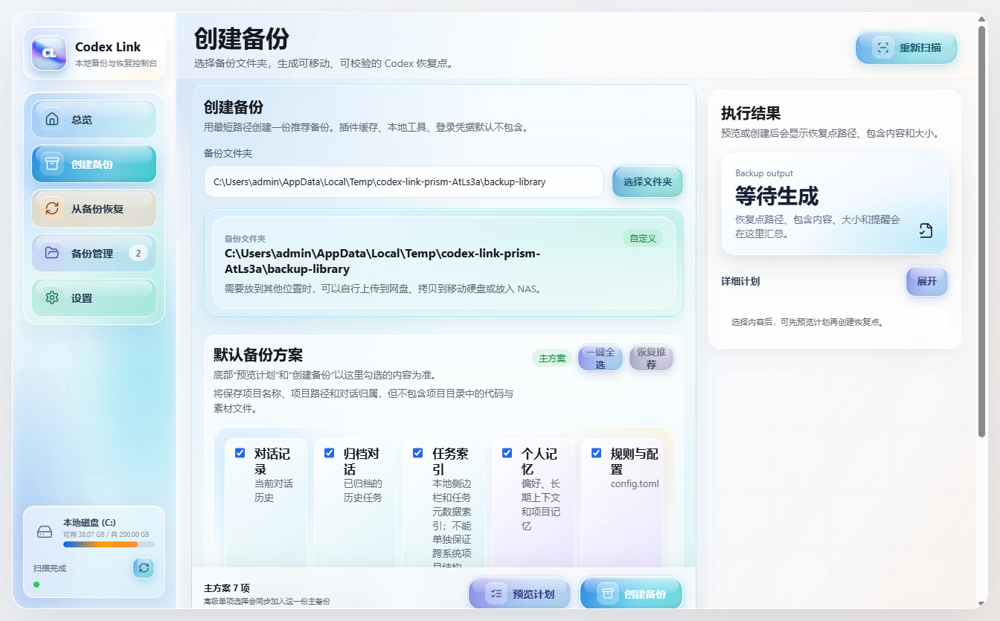
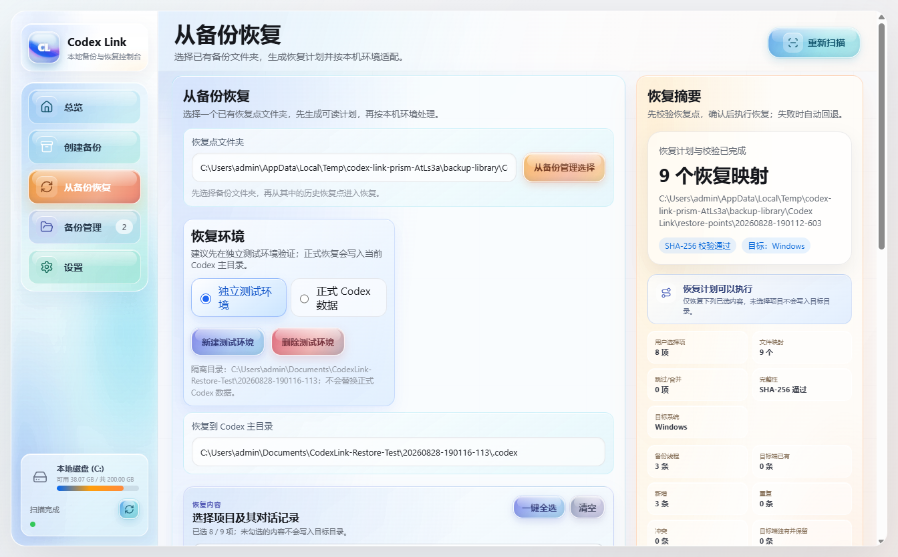
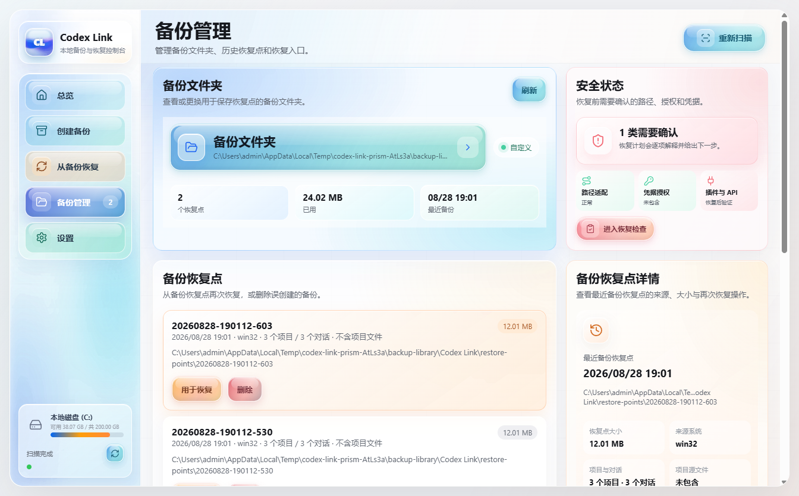

# Codex Link 3 分钟图文上手

Codex Link 是为一个很具体的痛点而生的：Codex 越用越重要，但它的本地工作环境并不是一个容易搬家的文件夹。

当你换电脑、重装系统、在 Windows 和 macOS 之间迁移，或者想把当前工作状态留一份可靠备份时，真正麻烦的不是复制几个文件，而是这些问题：

- 对话、归档对话、项目索引、规则、记忆和 Skills 分散在不同位置。
- 直接复制 `.codex` 目录容易把路径、SQLite 状态和系统差异一起带过去。
- API Key、登录 Token、`auth.json` 这类内容不能随便明文备份。
- 恢复一旦覆盖错了，原来的工作状态可能很难找回。
- 跨 Windows、macOS、Linux 时，路径和本地工具授权经常需要重新确认。

Codex Link 的目标不是做一个普通文件同步工具，而是给 Codex 本地环境提供“可预览、可校验、可回滚”的迁移与恢复流程。

下面的图片来自真实 App 界面截图，使用的是示例数据。

## 一句话流程

## 痛点一：不知道 Codex 本地环境里到底有什么

先打开“总览”，让 Codex Link 扫描本机 Codex 主目录和备份目录。它会把本地状态、备份文件夹、最近恢复点和可读性检查集中展示出来。

这一步解决的是“我到底要备份什么”的问题。迁移前先看清楚，后面才不容易误操作。

## 痛点二：只想备份重要工作，不想复制一堆风险文件

进入“创建备份”，先看默认备份方案。默认方案覆盖常见迁移内容，例如对话记录、归档对话、任务索引、个人记忆、规则配置、全局规则和 Skills。

如果你只想带走某些项目、某些对话或某些 Skills，可以在高级选项里精细选择。Codex Link 会先生成预览计划，再真正创建备份恢复点。

## 痛点三：换电脑恢复时，不敢确定会覆盖什么

在新电脑进入“从备份恢复”，选择恢复点后先查看“将恢复的内容”。项目记录、对话记录、归档对话、规则与 Skills 都会按分类显示。

需要展开“项目记录”时，直接点击整行即可查看明细。恢复前先确认目标系统、路径适配和高风险提示，再执行恢复。

## 痛点四：恢复失败或恢复错了，必须有退路

Codex Link 在恢复前会创建自动回滚点。恢复后如果发现不符合预期，可以从两个入口查看回滚记录：

- “设置”里的“查看回滚记录”
- “备份管理”里的“事务回滚点”

回滚点用于恢复前保护。执行回滚前，先关闭 Codex、ChatGPT 或可能占用本地数据文件的后台进程。

## 痛点五：凭据不能乱备份

为了降低安全风险，Codex Link 默认不会明文备份或恢复这些内容：

- API Key
- 登录 Token
- `auth.json`
- 账号会话
- 需要重新授权的插件凭据

恢复到新设备后，这类内容需要在目标设备重新登录或重新配置。

## 发布版校验

下载 Release 资产后，可以用 `SHA256SUMS.txt` 校验文件完整性。

Windows 安装包目前未签名，首次运行时系统可能出现安全提示。macOS 当前提供 Apple Silicon 源码包，不是已签名或公证的 DMG 安装器。

## 适合的使用场景

- 从旧电脑迁移 Codex 工作环境到新电脑。
- 给本地 Codex 数据做可验证备份。
- 在恢复前需要自动创建回滚点。
- 想按项目、对话或 Skills 精细选择恢复内容。
- Windows 与 macOS 路径差异需要人工确认或适配。